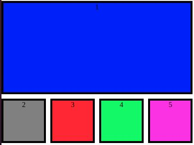
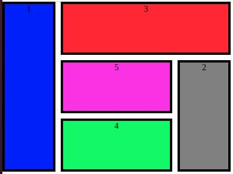

# Actividad de clase
Actividad a desarrollar en clase (10~15 minutos). Compartir el resultado por el canal del curso.

Utilice el explorador de tu preferencia y observa el resultado.
Contarás con 5/10 minutos para realizar la actividad.

### Enunciado:
- Dentro de la carpeta actividad_clase podrá encontrar un "index.html" con todo lo que necesitará.
- Dentro de la carpeta "css" ya cuenta con un archivo style.css con todos los estilos que necesitara.

Si abre el index.html verá el siguiente resultado:

- Modifique el "grid-template-areas" definido en el CSS para alcanzar el resultado deseado..

### Resultado aproximado:

