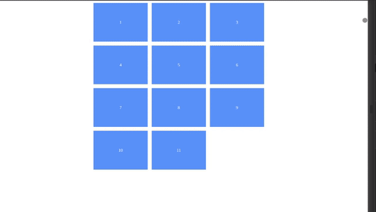

# Desafío

Para esta tarea vamos a poner en práctica los conceptos display flex y display gird.

Los pasos que debemos seguir para conseguir esta tarea, serán:

- Haber realizado el fork de este repositorio y haberlo descargado a su computadora.
- Generar el HTML pertinente para cada ejemplo
- Generar el CSS pertinente para cada ejemplo
- Tratar de replicar los ejemplos mostrados
- Utilizar las imagenes dentro de images

Finalmente te invitamos a que una vez que lo hallas logrado, dejes volar tu creatividad y generes otros ejemplos por tu cuenta o trates de integrar los ejemplos antes mostrados.

## Enunciado
Basado en lo visto en clase utilice diplay grid y auto-fit para generar un ejemplo de cajas similar al ralizado en clase.

Ejemplo de lo que se requiere:



Recuerde crear los archivos necesarios (HTML & CSS) dentro de esta carpeta.

Una vez logrado el resultado anterior, agreguele un ```<HEADER>``` con una navbar que inspirada en el siguiente ejemplo:


Encontrará todos los recursos en la carpeta images, deberá quedar toda la página responsiva y verse bien tanto en modo escritorio como en modo móvil.

Intente acercarse lo más posible. 

# Desafio finalizado
Verificado que todo funciona como se espera, deberá subir al campus el link de su respositorio en el desafio correspondiente para así concluir la realización del mismo.