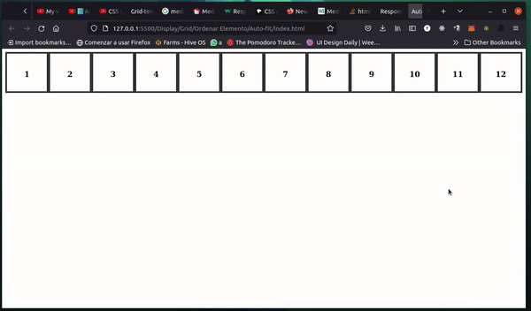
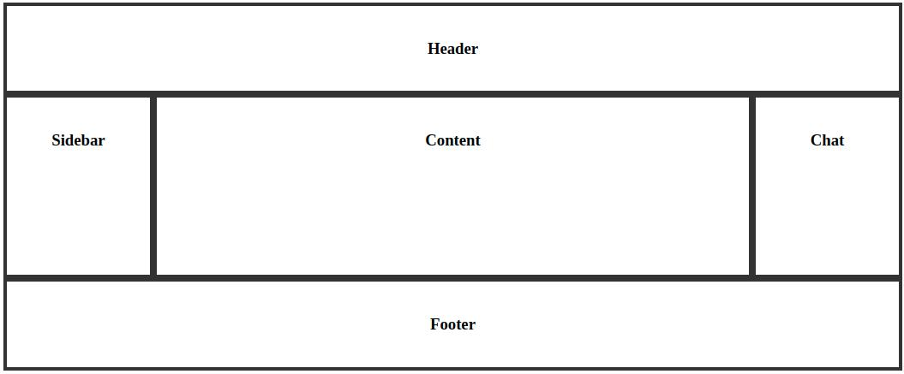
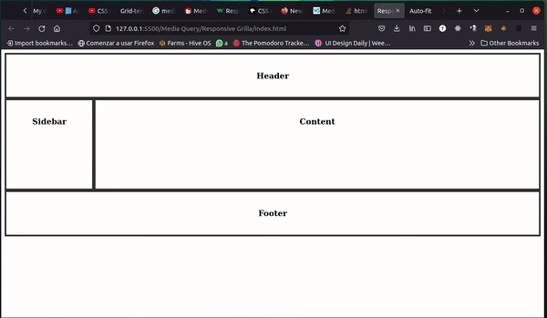

# Tarea

Para esta tarea tenemos como objetivo construir los siguientes ejemplos:

# Ejercicio 1

Utilice auto-fit para generar un ejemplo de cajas como el siguiente:



Deberá generar el HTML y css para este ejercicio.

Si se anima, ¿Porqué no coloca algunos íconos divertidos dentro de cada caja?

# Ejercicio 2
Tome el ejercicio anterior y agreguele un ```<HEADER>``` con una navbar que inspirada en el siguiente ejemplo:


Encontrará todos los recursos en la carpeta images, deberá quedar toda la página responsiva y verse bien tanto en modo escritorio como en modo móvil.

# Ejercicio 3
Utilice grid-template-areas para generar una aplicaciones con las siguientes secciones:



Deberá generar el HTML y CSS para este ejercicio. No es necesario que coloque elementos dentro de cada sección de la página, ¡pero sería interesante que lo hiciera!

# Ejercicio 4
Utilice media_query para organizar de otra forma las secciones que creó en el ejercicio anterior en modo móvil:



Deberá generar el HTML y CSS para este ejercicio. No es necesario que coloque elementos dentro de cada sección de la página, ¡pero sería interesante que lo hiciera!
